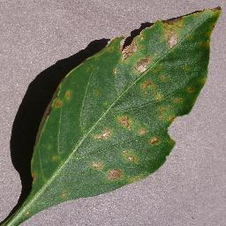
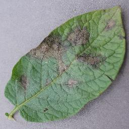
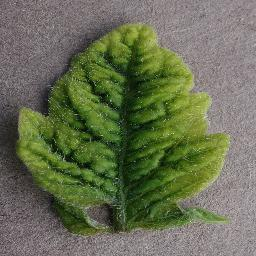
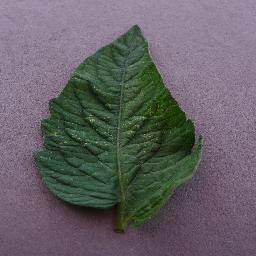
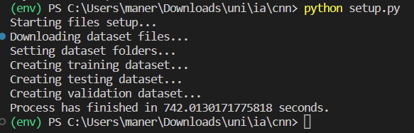
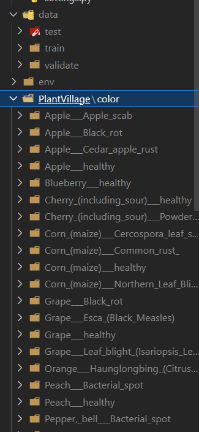

# Agro Plant Disease - Plant disease detection using a CNN accessible from a web server

by Emmanuel Antonio Ramirez Herrera
June 3, 2023

## Abstract

One of the most urgent challenges that the humanity is facing today is the need to increase food production by 70% by 2050 to feed an estimated population of over 9 billion people. However, this goal is threatened by the devastating impact of plant diseases on crop yields in developing countries and tropical ecosystems, especially in Mexico, where diverse diseases affect agricultural crops and their quality. Therefore, it is imperative to develop and implement effective strategies to combat outbreaks and prevent their spread. One of the most promising strategies is the use of artificial intelligence models for early and accurate detection of plant diseases using computer vision techniques, because this approach has several advantages over conventional methods, such as the ability to use smartphones as a low-cost and widely available tool for diverse communities that produce food, the potential to process large amounts of data and images in real time, and the possibility to integrate different sources of information and knowledge for diagnosis and intervention.

## Introduction

One of the most remarkable achievements of human history was the cultivation of plants in different regions of the world 8-12,000 years ago during the agricultural revolution, because his enabled the emergence of civilizations that could rely on a stable and regular source of calories that required less and less human labor to produce. However, this accomplishment is always at risk because plant diseases and pests reduce the global food supply by 40% every year and in addition, the world’s population grows by 1.6% annually, and so does the need for different types of plant products. Therefore, it is essential to protect crops from plant diseases in order to meet the increasing demand for food quantity and quality.

Howerver, the accessibility of plant disease detection methods depends on several factors, such as cost, availability, infrastructure, trained personnel and regulations. Each method has its advantages and disadvantages, and its accessibility may vary depending on the type of crop, region, market and level of technification of the producer. For example, in Mexico, there is an online platform called SIRVEF (Sistema Integral de Referencia para la Vigilancia Epidemiológica Fitosanitaria) that offers information on pests that affect crops, as well as guides of symptoms and damages, technical sheets, monthly reports of monitoring and citizen reports (SENASICA, 2021). It is a free and accessible service for anyone with internet access, but it depends on the quality and updating of the information provided.

In this work, I explore the possibility of using computer vision for scalable and cost-effective plant disease detection and I claim that this approach has several advantages over conventional methods, such as the ability to use smartphones as a low-cost and widely available tool for diverse communities that produce food, the potential to process large amounts of data and images in real time, and the possibility to integrate different sources of information and knowledge for diagnosis and intervention. I will support my claim by presenting a proposal for a novel artificial intelligence model that can be trained and deployed using a web server that can be consulted from a smartphone.

## Dataset

To the best of my knowledge, one of the few public datasets for plant disease detection is the PlantVillage dataset, however, the PlantVillage dataset images are taken in laboratory settings and not in the actual conditions of farming fields, which may affect their performance in real world scenarios. The dataset consists of 54,309 RGB images of 14 different crops: Apple, Blueberry, Cherry, Corn, Grape, Orange, Peach, Bell Pepper, Potato, Raspberry, Soybean, Squash, Strawberry, Tomato. The images show 17 fungal diseases, 4 bacterial diseases, 2 mold (oomycete) diseases, 2 viral disease, and 1 disease caused by a mite. For 12 crops, there are also images of healthy leaves that do not show any signs of disease. Most of the images have a size of 256 x 256 pixels.

| Figure 1. Example of fungal disease                              |                 Figure 2. Example of bacterial disease                 |                            Figure 3. Example of mold disease |
| ---------------------------------------------------------------- | :--------------------------------------------------------------------: | -----------------------------------------------------------: |
|  |  |  |
| ----------                                                       |                            :-------------:                             |                                                      ------: |
| Figure 4. Example of virus disease                               |                   Figure 5. Example of mite disease                    |                            Figure 6. Example of healthy leaf |
|    |            |       |

## CNN Model

### Architecture

This project uses a convolutional neural network as a deep learning model where it starts with a convolutional layer that has 32 filters with a 3x3 size, a 1 stride, and a ReLU activation function. The input shape is (224, 224) and is using RGB color channels (3 for RGB). After the convolutional layer, there is a max pooling layer with a 2x2 pool size, which halves the spatial dimensions of the feature maps.

The second convolutional layer has 64 filters of size 3x3, a stride of 1, and a ReLU activation function. The second max pooling layer has the same pool size as the first one. The third convolutional layer has 128 filters of size 3x3, a stride of 1, and a ReLU activation function. The third max pooling layer also has the same pool size as the previous ones.

After the third max pooling layer, the feature maps are flattened into a one-dimensional vector. The flattened vector is then passed to a dense layer with 256 units and a ReLU activation function. This layer performs a linear transformation on the input vector and adds some non-linearity to the model. The final dense layer has 38 units and a softmax activation function. This layer outputs a probability distribution over 38 classes, corresponding to the different types of plant diseases.

The model is compiled with the Adam optimizer, which is an adaptive gradient-based optimization algorithm that adjusts the learning rate based on the gradients. The loss function is categorical cross-entropy, which measures the difference between the predicted probabilities and the true labels.

### Justification

The model is useful because it can handle images with a relatively high resolution, which can capture more details and features of the plants and their diseases. The model has three convolutional layers with increasing numbers of filters (32, 64, and 128), which can learn more complex and abstract patterns from the images. The convolutional layers use filters of size 3x3, which are small enough to preserve the spatial information of the images, but large enough to cover a reasonable receptive field. The convolutional layers also use ReLU activation functions, which are simple and efficient to compute, and can avoid the problem of vanishing gradients. The convolutional layers are followed by max pooling layers with a pool size of 2x2, which can reduce the dimensionality and computational cost of the feature maps and also help to prevent overfitting by reducing the number of parameters in the model. After the max pooling layers, the feature maps are flattened into a one-dimensional vector, which is then passed to a dense layer with 256 units and a ReLU activation function. This layer can perform a linear transformation on the input vector and add some non-linearity to the model. The final dense layer has 38 units and a softmax activation function, which can output a probability distribution over 38 classes, corresponding to the different types of plant classifications. The model is compiled with the Adam optimizer, which is an adaptive gradient-based optimization algorithm that adjusts the learning rate based on the gradients. The loss function is categorical cross-entropy, which measures the difference between the predicted probabilities and the true labels.

## Implementation

### Environment setup

There are different ways to retrieve the required dataset, there's the Github option, the Tensorflow datasets option and the Kaggle one. Because of the easier api interaction, I chosed to use Kagle API to pull the dataset zip, unzip it and create the required folders from there.

I also wanted to maintain control for the folder structure and system and give the ability to anyone to personalize it. That's why I created the config files, where there's the ability to control the folder structura and names, modify the resulting model name and have an easy way to implement different training options.

The setup divides the obtained files into 3 different categories: train, test and validation. For the last iteration I left 80% of data for training and even 10% for the validation and testing data.

The setup creates the required folders for each class contained on the dataset and on the right validation, testing or training category.

In order to obtain the dataset needed for this project, I used the Kaggle API to download the zip file from the online platform, unzip it and create the necessary folders from there. I chose this option because it allows for an easy interaction with the API and avoids the need to clone a large repository from Github.

I also wanted to have control over the folder structure and system and enable anyone to customize it. That's why I created the config files, where one can control the folder names and structure, change the name of the resulting model and have an easy way to implement different training options.

The setup splits the obtained files into three different categories: train, test and validation. For the last iteration, I used 80% of the data for training and 10% each for validation and testing. The setup also creates the required folders for each class in the dataset and places them in the appropriate validation, testing or training category.

Figure 7. Example of data setup run

Figure 8. Example of data setup result

### Model training

One of the main challenges for the training was that I wanted to be able to apply transfer learning, which is a technique that allows using a pre-trained model as a starting point. This is because I was using a very large amount of data for the training and I knew that it would take too long for each training session, therefore, I wanted to have the option to start training from a previous checkpoint. The resulting code gives the user the choice between training from scratch or providing the path to a checkpoint model to resume training from.

I structured the training in a modular way, where each function has a very specific task and it is easy to fix errors if they occur. I also followed the DRY (Don’t Repeat Yourself) principle and wrote efficient code.

Moreover, because of the config files, it is easy to choose different training options without making too many changes. The user just needs to set the required attributes inside the settings.py file. This results in an easy way to modify parameters such as epochs, steps per epoch and batch sizes.

The data generators function normalizes the data and creates more images for the training by using data augmentation techniques, where the images are rotated, shifted, zoomed and flipped. You may wonder why adding more images to this big dataset, but the reason is that the provided images have no transformations and when taking photos of leaves in the real world you cannot control the environment as much as how the pictures were taken, so I wanted to add some noise.

The training function just takes the required parameters and starts training the model, returning the resulting history. That history is then passed to the plotting function that plots the loss and accuracy obtained along the epochs.

After all the training and plotting is done, we need to evaluate the model capabilities, so I tried to make an automated evaluation by using the different datasets: testing, validation and training. The evaluate function applies the keras model.evaluate built-in function and then sets the resulting score, which will be used later.

After all the training and evaluation has been done, there is just left to save the model. For that, I wanted to have a way to distinguish between the different trained models and automate the naming, so I used the obtained score and the given model name to do so. I also needed to store the classes for the predictions, so I did that by saving them inside a csv file.

## References

- De la Torre Almaraz, R. (2014). Enfermedades de cultivos en México. Comisión Nacional para el Conocimiento y Uso de la Biodiversidad. http://www.conabio.gob.mx/institucion/proyectos/resultados/JC009_Anexo%201.pdf

- FAO. (2009). How to feed the world in 2050. http://www.fao.org/fileadmin/templates/wsfs/docs/expert_paper/How_to_Feed_the_World_in_2050.pdf

- Statista. (2019). Number of smartphone users worldwide from 2016 to 2021 (in billions). https://www.statista.com/statistics/330695/number-of-smartphone-users-worldwide/

- SENASICA. (2021). Sistema Integral de Referencia para la Vigilancia Epidemiológica Fitosanitaria. https://prod.senasica.gob.mx/SIRVEF/

- Oerke, E.-C. (2006). Crop losses to pests. Journal of Agricultural Science, 144(1), 31–43. https://doi.org/10.1017/S0021859605005708

- Diamond, J. (2002). Evolution, consequences and future of plant and animal domestication. Nature, 418(6898), 700-707. https://doi.org/10.1038/nature01019

- Hughes, D. P., & Salathé, M. (2015). An open access repository of images on plant health to enable the development of mobile disease diagnostics. arXiv. https://arxiv.org/ftp/arxiv/papers/1511/1511.08060.pdf
